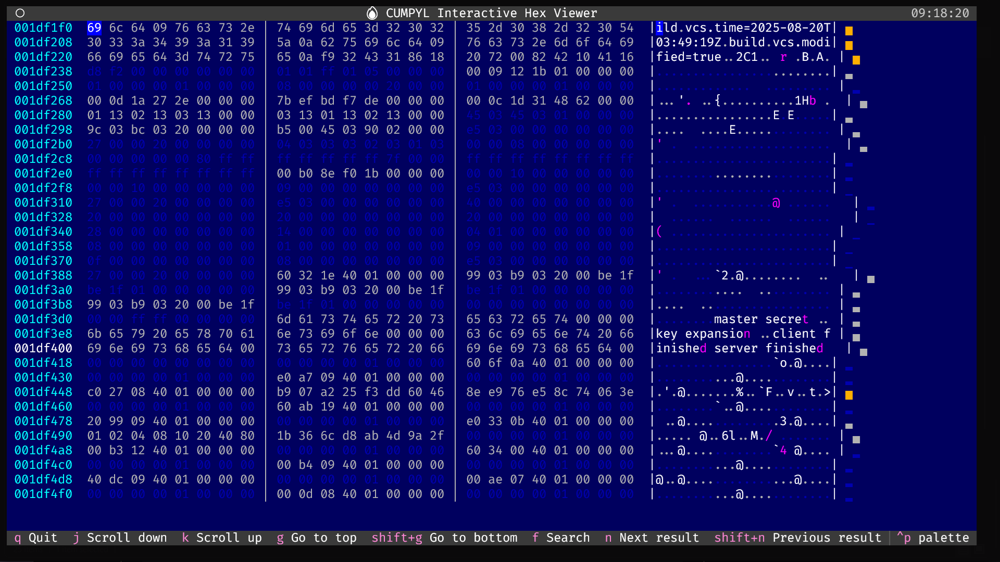
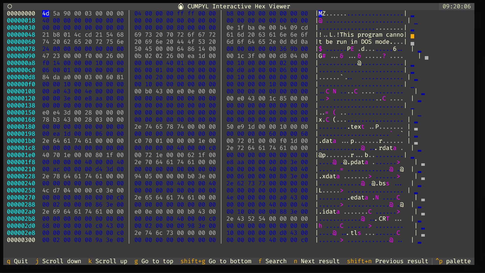

<div align="center">
  <h1>·𐑒𐑳𐑥𐑐𐑲𐑫𐑤 (Cumpyl)</h1>
  <p><b>THE BINARY ANALYSIS & OBFUSCATION FRAMEWORK</b></p>
  
  
</div>

<div align="center">
  
  
  &nbsp;
  
  &nbsp;
  
  &nbsp;
  
  
</div>

<p align="center">
  <a href="#overview">Overview</a>
  <a href="#features">Features</a>
  <a href="#installation">Installation</a>
  <a href="#quick-start">Quick Start</a>
  <a href="#architecture">Architecture</a>
  <a href="#obfuscation-tiers">Obfuscation</a>
  <a href="#plugins">Plugins</a>
  <a href="#contributing">Contributing</a>
</p>

<hr>

<br>

## 𐑴𐑝𐑻𐑝𐑿 --> OVERVIEW

**Cumpyl** is a powerful binary analysis framework designed to analyze, modify, and obfuscate executable files across multiple formats.

The framework provides intelligent obfuscation recommendations, comprehensive analysis plugins, and advanced packing capabilities for PE, ELF, and Mach-O binaries.

### 𐑞 𐑐𐑲𐑐𐑤𐑲𐑯 --> THE PIPELINE

---

<div align="center">
  
</div>

---

**Cumpyl**:

1. **ANALYZES** binary structure and sections with comprehensive plugin support
2. **RECOMMENDS** optimal obfuscation strategies using intelligent tier system
3. **TRANSFORMS** binaries with encoding, packing, and obfuscation techniques
4. **REPORTS** detailed analysis results in multiple formats (HTML, JSON, YAML, XML)

The core of `Cumpyl` is built on powerful libraries like [LIEF](https://lief.re/), [Capstone](http://www.capstone-engine.org/), and [Keystone](https://www.keystone-engine.org/), providing robust binary manipulation capabilities with an extensible plugin architecture.

<br>

## 𐑦𐑯𐑕𐑑𐑭𐑤 --> INSTALLATION

### PREREQUISITES

- Python 3.9 or higher
- pip or uv package manager

### 𐑚𐑦𐑤𐑛𐑦𐑙 --> BUILDING

**MODERN INSTALLATION (RECOMMENDED WITH UV):**

```bash
# Install uv package manager
curl -LsSf https://astral.sh/uv/install.sh | sh

# Clone and install
git clone https://github.com/umpolungfish/cumpyl.git
cd cumpyl
uv sync  # Creates virtual environment and installs all dependencies

# Activate environment
source .venv/bin/activate  # Windows: .venv\Scripts\activate
```

**TRADITIONAL INSTALLATION:**

```bash
git clone https://github.com/umpolungfish/cumpyl.git
cd cumpyl
pip install -e .
```

### 𐑚𐑱𐑕𐑦𐑗 𐑿𐑕𐑦𐑡 --> BASIC USAGE

**1. LAUNCH INTERACTIVE MENU**

The easiest way to get started is with the interactive menu system:

```bash
cumpyl sample.exe --menu
```

**2. QUICK OBFUSCATION ANALYSIS**

Get intelligent section encoding recommendations:

```bash
cumpyl sample.exe --suggest-obfuscation
```

**3. COMPREHENSIVE ANALYSIS**

Run full analysis with all plugins:

```bash
cumpyl sample.exe --run-analysis --all-plugins --report-format html
```

<br>

## 𐑓𐑰𐑗𐑺𐑟 --> FEATURES

<table>
<tr>
<td width="50%">

### CORE CAPABILITIES

- **Multi-format support** for PE, ELF, and Mach-O binaries
- **Plugin architecture** with extensible analysis and transformation
- **Intelligent obfuscation** using color-coded tier system
- **Batch processing** with multi-threaded file operations
- **Interactive hex viewer** in terminal and browser modes
- **Comprehensive reporting** in HTML, JSON, YAML, and XML
- **Advanced encoding** methods for section obfuscation

</td>
<td width="50%">

### OBFUSCATION TIERS

Intelligent recommendations for safe binary modification:

- **ADVANCED** - Large, high-impact sections (`.rdata`, `.rodata`)
- **INTERMEDIATE** - Medium-size data sections (`.data`, `.bss`)
- **BASIC** - Small, low-impact sections (`.pdata`, `.xdata`)
- **AVOID** - Critical sections (`.text`, `.code`, `.idata`, `.reloc`)

</td>
</tr>
</table>

<br>

## 𐑥𐑭𐑛𐑿𐑤𐑼 𐑸𐑒𐑦𐑑𐑧𐑒𐑗𐑼 --> MODULAR ARCHITECTURE

`Cumpyl` features a clean, extensible architecture with plugin-based analysis:

### 𐑒𐑹 𐑒𐑳𐑥𐑐𐑴𐑯𐑦𐑯𐑑𐑕 CORE COMPONENTS

| Component | Module | Purpose |
|-----------|--------|---------|
| **Binary Parser** | `lief` | Multi-format binary parsing and manipulation |
| **Disassembler** | `capstone` | Instruction-level disassembly |
| **Assembler** | `keystone` | Dynamic code generation |
| **Plugin System** | `plugins/` | Extensible analysis and transformation |
| **Interactive UI** | `textual` | Rich terminal user interface |

### 𐑐𐑤𐑳𐑜𐑦𐑯 𐑥𐑭𐑛𐑿𐑤𐑟 --> PLUGIN MODULES

Specialized plugins for comprehensive analysis:

- `entropy_analysis.py` - Shannon entropy calculation for packed binary detection
- `string_extraction.py` - Advanced string extraction with context scoring
- `section_analysis.py` - Automatic classification and safety assessment
- `packer_detection.py` - Identify packing techniques and compression
- `cfg_extractor.py` - Control Flow Graph extraction using angr
- `go_binary_analysis.py` - Specialized Go binary analysis
- `cgo_analysis.py` - CGO-enabled binary analysis
- `ca_packer.py` - Cellular Automata-based packing

### 𐑸𐑒𐑦𐑑𐑧𐑒𐑗𐑼 𐑚𐑧𐑯𐑧𐑓𐑦𐑑𐑕 --> ARCHITECTURE BENEFITS

<table>
<tr>
<td><b>MAINTAINABILITY</b></td>
<td>Clear plugin separation and interfaces</td>
</tr>
<tr>
<td><b>EXTENSIBILITY</b></td>
<td>Easy plugin development and integration</td>
</tr>
<tr>
<td><b>TESTABILITY</b></td>
<td>Independent plugin testing framework</td>
</tr>
<tr>
<td><b>SCALABILITY</b></td>
<td>Multi-threaded batch processing support</td>
</tr>
<tr>
<td><b>CLEAN INTERFACE</b></td>
<td>Interactive menu system for all features</td>
</tr>
</table>

<br>

## OBFUSCATION TIERS

`Cumpyl` employs an intelligent tier-based system for safe binary obfuscation:

### TIER CLASSIFICATION

<details>
<summary><b>Click to expand tier details</b></summary>

#### ADVANCED TIER (Large, High-Impact Sections)
- **Best for**: Heavy obfuscation with complex encoding
- **Capacity**: Large sections with significant data
- **Examples**: `.rdata`, `.rodata`, large constant data
- **Safety**: High - minimal impact on execution

#### INTERMEDIATE TIER (Medium-Size Data Sections)
- **Best for**: Moderate obfuscation with balanced safety
- **Capacity**: Medium sections with mixed data
- **Examples**: `.data`, `.bss`, initialized data
- **Safety**: Medium - requires careful validation

#### BASIC TIER (Small, Low-Impact Sections)
- **Best for**: Light obfuscation of small sections
- **Capacity**: Small sections with minimal impact
- **Examples**: `.pdata`, `.xdata`, exception data
- **Safety**: Low impact - suitable for testing

#### AVOID TIER (Critical Sections)
- **Best for**: No obfuscation - critical for execution
- **Capacity**: N/A - modification will break binary
- **Examples**: `.text`, `.code`, `.idata`, `.reloc`
- **Safety**: DANGEROUS - avoid at all costs

</details>

### ENCODING METHODS

<details>
<summary><b>Click to expand encoding strategies</b></summary>

| Method | Description | Use Case |
|--------|-------------|----------|
| `hex` | Hexadecimal encoding | Simple obfuscation |
| `octal` | Octal escape sequences | Alternative encoding |
| `base64` | Standard Base64 | Common obfuscation |
| `compressed_base64` | Zlib + Base64 | Size reduction + obfuscation |
| `null` | Null byte padding | Basic transformation |

**EXAMPLE USAGE:**

```bash
# Encode specific section
cumpyl binary.exe --encode-section .rdata --encoding base64 -o encoded.exe

# Encode multiple sections
cumpyl binary.exe --encode-section .rdata --encoding base64 \
                  --encode-section .data --encoding hex -o encoded.exe

# Encode with compression
cumpyl binary.exe --encode-section .rdata --encoding compressed_base64 \
                  --compression-level 9 -o encoded.exe
```

</details>

### INTELLIGENT RECOMMENDATIONS

<details>
<summary><b>Click to expand recommendation engine</b></summary>

The tier system automatically analyzes binaries and provides color-coded recommendations:

```bash
# Get obfuscation suggestions
cumpyl sample.exe --suggest-obfuscation

# Output example:
# .rdata (Advanced Tier) - 45KB - Best for heavy obfuscation
# .data (Intermediate Tier) - 12KB - Moderate obfuscation safe
# .pdata (Basic Tier) - 2KB - Light obfuscation only
# .text (AVOID) - 128KB - Critical section, do not modify
```

The recommendation engine considers:
- Section size and type
- Read/write/execute permissions
- Section content characteristics
- Binary format and architecture
- Safety thresholds and heuristics

</details>

<br>

## PLUGIN SYSTEM

The plugin architecture provides extensible analysis and transformation capabilities:

### ANALYSIS PLUGINS
Load and analyze binaries with specialized detection:
- **Entropy Analysis** - Detect packed or encrypted sections
- **String Extraction** - Context-aware string identification
- **Packer Detection** - Identify compression and obfuscation
- **CFG Extraction** - Generate control flow graphs

### TRANSFORMATION PLUGINS
Modify binaries with safe, reversible operations:
- **Encoder Plugins** - Apply various encoding schemes
- **Packer Plugins** - Compress and encrypt sections
- **CA Packer** - Cellular Automata-based obfuscation

### SPECIALIZED PLUGINS
Format-specific analysis and modification:
- **Go Binary Analysis** - Detect Go runtime and build info
- **CGO Analysis** - Analyze CGO-enabled binaries
- **PEB Traversal** - Windows-specific API resolution

### PLUGIN MANAGEMENT
Easy discovery and configuration:

```bash
# List all available plugins
cumpyl --list-plugins

# List analysis plugins only
cumpyl --list-analysis-plugins

# List transformation plugins only
cumpyl --list-transformation-plugins

# Get detailed plugin information
cumpyl --plugin-info entropy_analysis

# Run specific plugins
cumpyl binary.exe --run-analysis --plugins entropy_analysis,string_extraction
```

### PLUGIN OUTPUT
Results integrated into comprehensive reports with multiple format options.

<br>

## INTERACTIVE MENU SYSTEM

<div align="center">
  
</div>

### MENU STRUCTURE

```
Cumpyl Main Menu
┌── 1. Quick Analysis
├── 2. Deep Analysis
├── 3. Interactive Hex Viewer
├── 4. Batch Processing
├── 5. Encoding Operations
├── 6. Binary Packers
│   ├── Plugin Packer Menu
│   │   ├── 1. Analyze binary
│   │   ├── 2. Transform binary
│   │   ├── 3. Change binary file
│   │   └── 4. List available plugins
│   └── Real Packer Integration
├── 7. Report Generation
├── 8. Configuration
├── 9. Change Target
└── 0. Exit
```

### MENU FEATURES

- **Rich Terminal UI** using Textual framework
- **Guided Workflows** for complex operations
- **Quick Actions** for common tasks
- **Real-time Feedback** with progress indicators
- **Visual Results** with formatted output

<br>

## ADVANCED FEATURES

### CELLULAR AUTOMATA PACKER

The CA packer uses Rule 30 cellular automaton for pseudo-random mask generation:

<details>
<summary><b>Click to expand CA packer details</b></summary>

#### HOW IT WORKS

1. **Loading** - Parse binary with LIEF
2. **Analysis** - Identify sections and entry point
3. **Encryption** - ChaCha20-Poly1305 authenticated encryption
4. **CA Masking** - XOR with Rule 30-generated masks
5. **Stub Integration** - Inject unpacking stub

**USAGE:**

```bash
# Basic CA packing
cumpyl binary.exe --pack --packer ca -o packed.exe

# CA packing with custom steps
cumpyl binary.exe --pack --packer ca --ca-steps 150 -o packed.exe

# Analyze for CA packing suitability
cumpyl binary.exe --analyze-packing --packer ca
```

**SECURITY FEATURES:**

- Deterministic chaos via Rule 30
- ChaCha20-Poly1305 authenticated encryption
- SHA-256 key derivation
- Block-level unique masking

</details>

### BATCH PROCESSING

Process multiple binaries efficiently with multi-threading:

<details>
<summary><b>Click to expand batch processing</b></summary>

```bash
# Process directory
cumpyl --batch-directory /samples --batch-operation plugin_analysis

# Recursive processing
cumpyl --batch-directory /dataset --batch-recursive

# Custom file patterns
cumpyl --batch-pattern "*.exe" --batch-pattern "*.dll" --batch-operation analyze_sections

# Multi-threaded with report generation
cumpyl --batch-directory /samples --batch-operation plugin_analysis \
       --report-format json --report-output batch_results.json
```

</details>

### HEX VIEWER

Dual-mode hex viewing for binary exploration:

<details>
<summary><b>Click to expand hex viewer features</b></summary>

**TERMINAL MODE (Textual TUI):**

```bash
# Launch interactive hex viewer
cumpyl binary.exe --hex-view

# View specific range
cumpyl binary.exe --hex-view --hex-start 0x1000 --hex-end 0x2000
```

**BROWSER MODE (HTML):**

```bash
# Generate HTML hex viewer
cumpyl binary.exe --hex-view --output hex_viewer.html
```

**FEATURES:**

- Syntax highlighting for different data types
- Search functionality across binary
- Bookmarking capabilities
- Export to various formats
- Side-by-side comparison mode

</details>

<br>

## LIMITATIONS AND FUTURE DEVELOPMENT

`Cumpyl` is actively developed with expanding capabilities:

### CURRENT LIMITATIONS

- **Format support** - Some exotic binary formats not yet supported
- **Plugin coverage** - Expanding analysis plugin library
- **Performance** - Very large binaries (>100MB) may be slow
- **Platform support** - Some features platform-specific

### FUTURE ROADMAP

- Additional binary format support (Mach-O enhancements)
- Expanded plugin library and marketplace
- Machine learning-based packer detection
- Performance optimizations for large files
- Enhanced testing and verification tools
- Binary diffing and comparison features

<br>

## CONTRIBUTING

Contributions are welcome! Feel free to:

- Report bugs and issues
- Suggest new features and plugins
- Submit pull requests
- Improve documentation
- Add test cases and verification tools

### CONTRIBUTION PROCESS

1. Fork the repository
2. Create a feature branch
3. Make your changes with tests
4. Update documentation
5. Submit a pull request

### CODE STYLE

- Follow PEP 8 guidelines
- Use type hints where possible
- Write clear docstrings
- Include unit tests for new functionality

<br>

## DOCUMENTATION

Comprehensive documentation available:

- [User Guide](docs/CUMPYL_USER_GUIDE.md) - Complete usage guide
- [Developer Guide](docs/CUMPYL_DEVELOPER_GUIDE.md) - Plugin development
- [API Reference](docs/CUMPYL_API_REFERENCE.md) - Detailed API docs
- [Release Notes](docs/CUMPYL_RELEASE_NOTES.md) - Version history

<br>

## LICENSE

`Cumpyl` is available in the **public domain**. See the Unlicense for details.

<br>

<div align="center">
  <hr>
  <p><i>trust nothing!</i></p>
  <p><b>cumpyl</b> - for digital foolz</p>
</div>